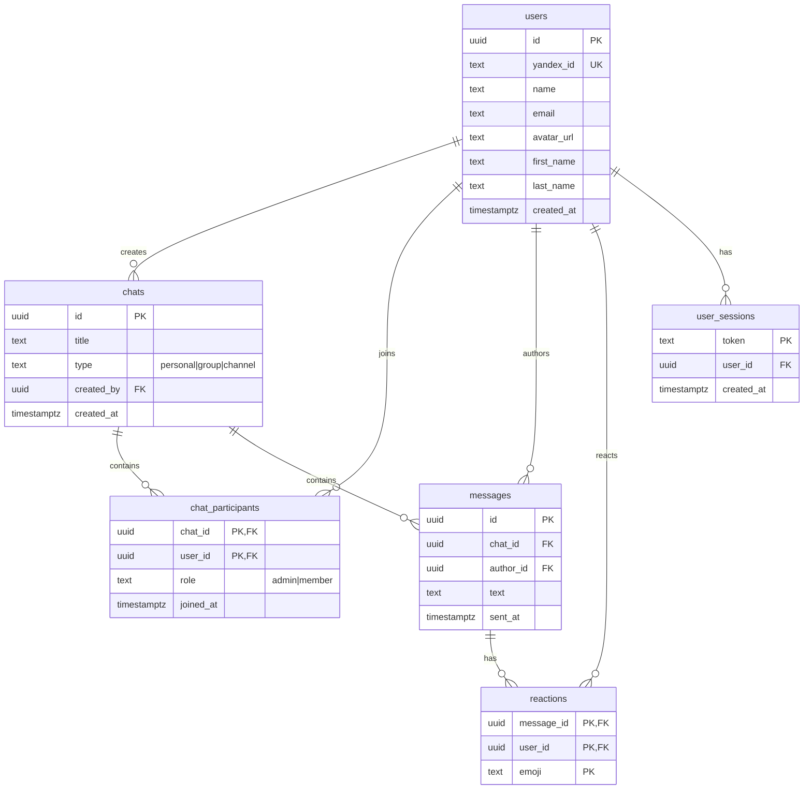

# Messenger MVP

Приватный AI-native мессенджер. Flutter (iOS/Android/Web) + TypeScript backend.

[Архитектура](./docs/ai-native-messenger-architecture.ru.md)

## Быстрый старт

Backend:

```bash
cd apps/api_server
npm run dev
```

Flutter web (в другом терминале):

```bash
cd apps/flutter_app
flutter pub get
flutter run -d web-server --web-hostname 127.0.0.1 --web-port 8080
```

Открыть `http://127.0.0.1:8080`. API на `http://127.0.0.1:3000`.

Без переменных окружения работает демо-вход — MVP запускается сразу.

## Яндекс OAuth

Для реального входа через Яндекс:

```bash
export YANDEX_CLIENT_ID=...
export YANDEX_CLIENT_SECRET=...
export YANDEX_REDIRECT_URI=http://127.0.0.1:3000/api/auth/yandex/callback
export FRONTEND_URL=http://127.0.0.1:8080
```

Профиль заполняется из Яндекс-аккаунта: имя, фамилия, email, аватар. Сессия сохраняется
в localStorage (web) / файл (native) и восстанавливается при перезагрузке.

## Зеркало Flutter

Если Google Cloud Storage недоступен:

```bash
export FLUTTER_STORAGE_BASE_URL="https://storage.flutter-io.cn"
flutter precache
```

## Реализовано

- [x] Яндекс OAuth + демо-вход, профиль (имя, email, аватар), сохранение сессии
- [x] Персональные чаты, группы, каналы (создание через «+», иконки, счётчик участников)
- [x] Отправка сообщений, автор из сессии
- [x] Реакции: двойной тап 👍, лонг-пресс — 10 эмодзи, чипы со счётчиком
- [x] WebSocket realtime (аутентификация, доставка сообщений и реакций)
- [x] REST API + CORS + in-memory хранилище (готово к PostgreSQL/Redis)
- [x] CI/CD (GitHub Actions): backend smoke test, Flutter analyze + unit-тесты

## Структура

```
apps/
├── api_server/     # TypeScript backend (Node 25, ws)
│   └── src/
│       ├── config/      # env-конфигурация
│       ├── domain/      # доменные типы (Chat, Message, Reaction)
│       ├── data/        # in-memory хранилища (→ PostgreSQL/Redis)
│       ├── http/        # JSON/CORS helpers
│       ├── routes/      # auth, chat endpoints
│       └── ws/          # WebSocket-сервер
└── flutter_app/    # Flutter-клиент (нулевые внешние зависимости)
    └── lib/
        ├── core/api/         # HTTP-клиент (REST)
        ├── core/ws/          # WebSocket-клиент
        ├── core/storage/     # персистентность сессии
        ├── features/auth/    # вход через Яндекс OAuth / demo
        ├── features/chat/    # чаты, сообщения, реакции
        └── models/           # User, Chat, Message
```

## Схема БД


